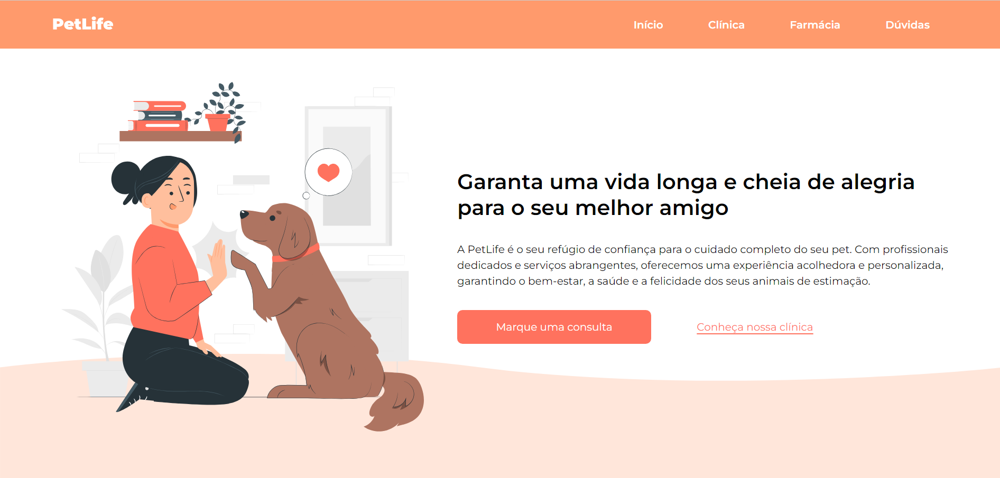

# PetLife

 Este foi um projeto que desenvolvi no mini curso gratuito da Onebitcode. Ele foi feito acompanhado com um figma disponibilizado na plataforma para termos uma referência de como deve ficar o projeto final. Ao fim do mini curso é feito um questionário do qual será disponibilizado um certificafdo de conclusão.

Caso tenha interesse em fazer o mini curso este é o link: [Mini Curso Start na Programação (HTML, CSS e Java Script)](https://www.onebitcode.com/minicurso)

# Como executar o projeto

```bash
# clonar repositório
git clone https://github.com/eduardavieira-dev/PetLife.git
# executar o comando npm start

```


